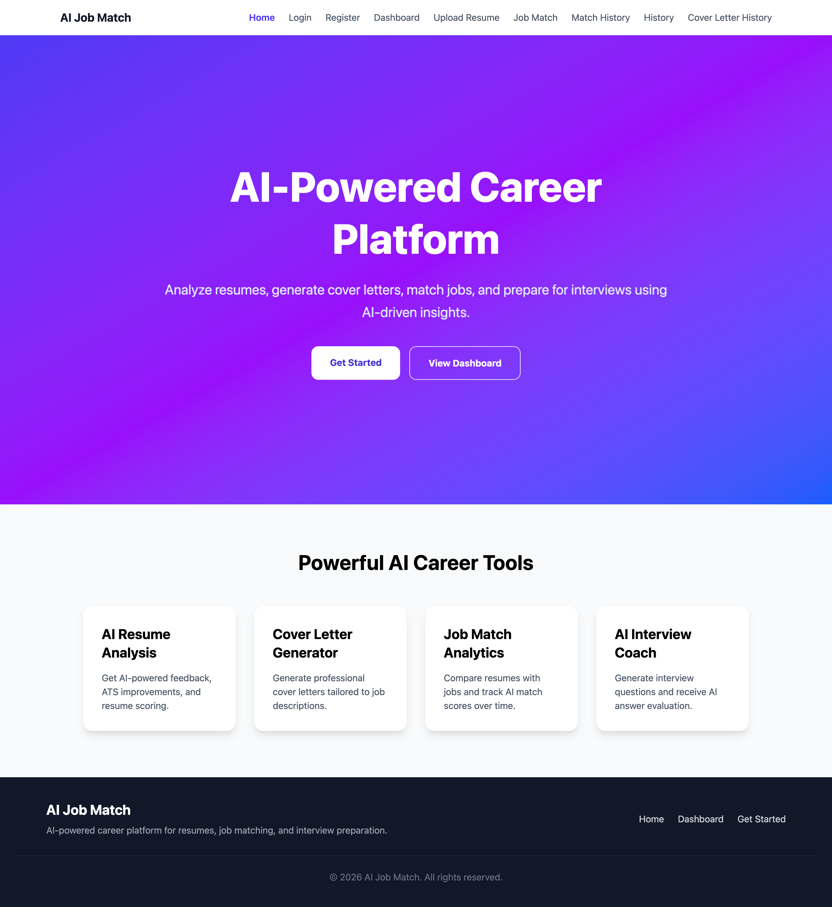
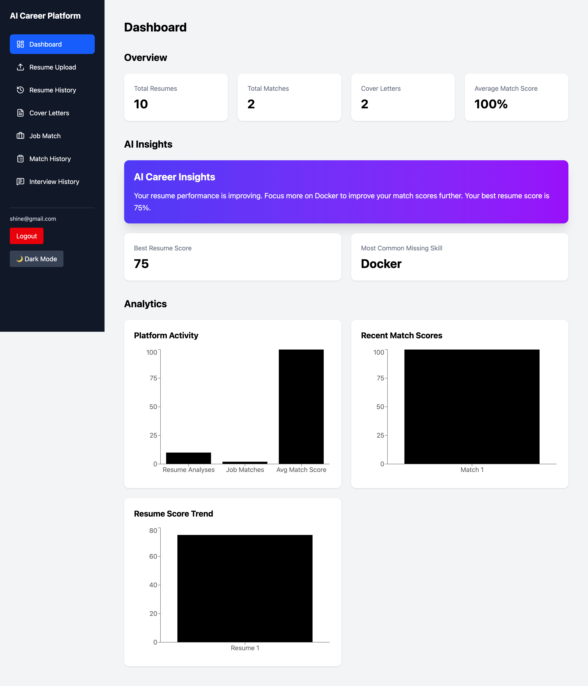
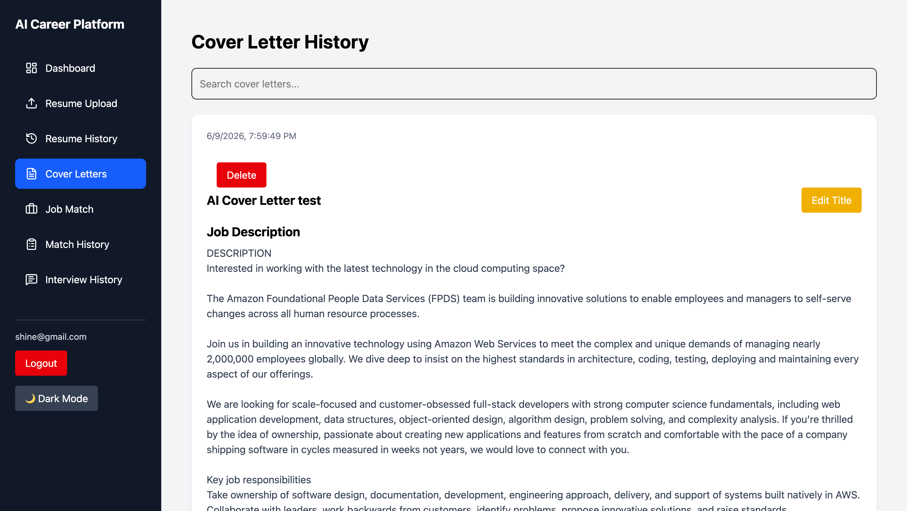
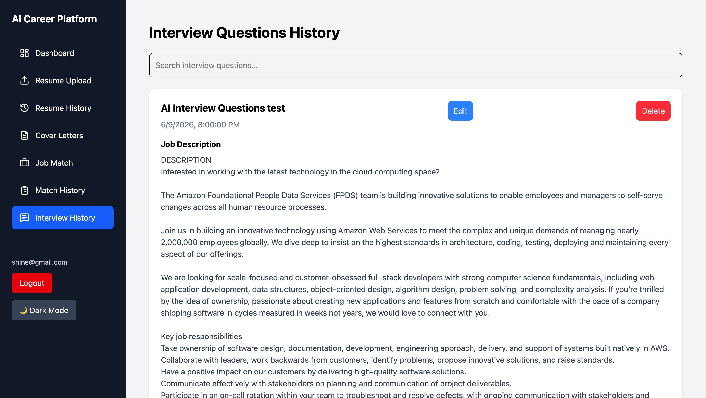
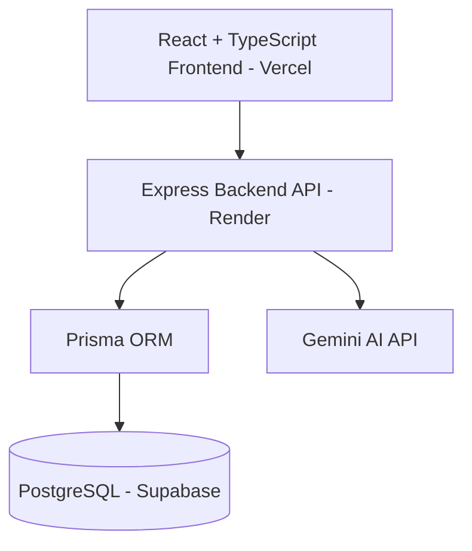

# AI Resume & Career Platform

AI-powered full-stack career platform that helps job seekers analyze resumes, generate cover letters, match jobs, and prepare for interviews using Gemini AI.

## Live Demo

Frontend:
https://ai-resume-job-platform-five.vercel.app

Backend API:
https://ai-resume-job-platform-o0ky.onrender.com

## Screenshots

### Home



### Dashboard



### Cover Letter



### Interview History



## Features

### Authentication

- JWT Authentication
- Register/Login
- Protected Routes
- User-specific data access

### Resume Tools

- Resume Upload
- PDF Text Extraction
- AI Resume Analysis
- Resume Score Visualization
- Missing Skills Detection
- AI Improvement Suggestions

### Career Tools

- AI Cover Letter Generator
- AI Job Match Scoring
- AI Interview Question Generator
- AI Answer Evaluation

### Dashboard & Analytics

- Resume Score Trends
- Match Score Analytics
- Platform Activity Charts
- AI Insights Dashboard

### History Management

- Resume Analysis History
- Cover Letter History
- Interview History
- Search & Filter
- Edit Records
- Delete Records

### User Experience

- Dark Mode
- Responsive Design
- Mobile Sidebar
- Loading Skeletons
- Toast Notifications

## Tech Stack

### Frontend

- React
- TypeScript
- Tailwind CSS
- React Router
- Recharts

### Backend

- Node.js
- Express
- Prisma ORM
- JWT Authentication
- Gemini API

### Database

- PostgreSQL
- Supabase

### Deployment

- Vercel
- Render

## Architecture



## Installation

### Backend

```bash
npm install
npx prisma migrate dev
npm start
```

### Frontend

```bash
npm install
npm run dev
```

## Future Improvements

- Resume PDF export
- Interview PDF export
- AI Career Roadmap Generator
- AI Resume Version Comparison
- Email Notifications
- Advanced Analytics

## Author

Htet Aung Shine

Software Engineer | Full-Stack Developer

GitHub: https://github.com/htetaungshine2111/ai-resume-job-platform.git

LinkedIn: https://linkedin.com/in/htetaung-shine
