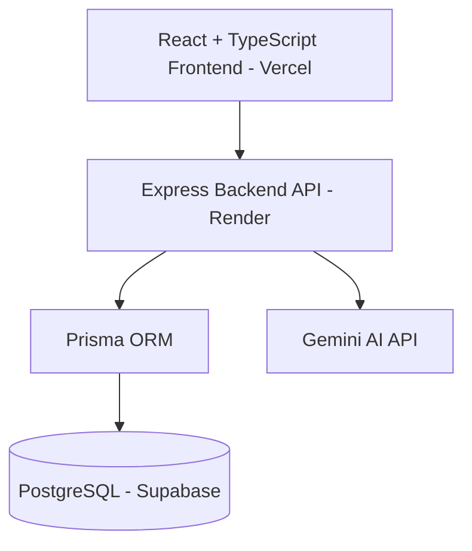

## Tech Stack

- React + TypeScript
- Node.js + Express
- PostgreSQL
- Prisma
- JWT Authentication
- Tailwind CSS
- Recharts

## Features

- Register/Login
- Protected routes
- Resume upload
- PDF parsing
- Resume analysis
- Job matching
- Search/filter
- Pagination
- Dashboard analytics
- User-specific data

## Run Locally

Backend:
npm install
npx prisma migrate dev
node server.js

Frontend:
npm install
npm run dev

## Live Demo

Frontend:
https://ai-resume-job-platform-five.vercel.app

Backend API:
https://ai-resume-job-platform-o0ky.onrender.com

## Tech Stack

# AI Resume & Career Platform

AI-powered full-stack career platform that helps users analyze resumes, generate cover letters, match jobs, and prepare for interviews.

## Live Demo

Frontend: your Vercel URL  
Backend API: your Render URL

## Features

- User authentication with JWT
- Resume upload and text extraction
- AI resume feedback using Gemini
- Resume score visualization
- AI cover letter generator
- AI interview question generator
- Job match scoring
- Dashboard analytics
- Resume and cover letter history
- Search, edit, and delete history records
- Dark mode
- Responsive sidebar layout

## Tech Stack

Frontend:

- React
- TypeScript
- Tailwind CSS
- React Router
- Recharts

Backend:

- Node.js
- Express
- Prisma ORM
- JWT Authentication
- Gemini API

Database:

- PostgreSQL
- Supabase

Deployment:

- Vercel
- Render

## Architecture

